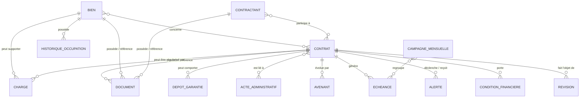

# MANIFESTE V3 — APPLICATION DE GESTION LOCATIVE

**Version : 3.0 — Formalisation atomique avant réunion finale**  
**Date : 7 octobre 2026**  
**Statut : cadrage fonctionnel consolidé — développement non lancé**  
**Objet : transformer le cadrage métier V2 en spécification fonctionnelle atomique, traçable et testable, sans inventer les décisions encore ouvertes.**

---

## 1. Règles de vérité

Le présent manifeste consolide et formalise le cadrage déjà établi. Il ne remplace pas les décisions métier par des hypothèses techniques.

Ordre de référence :
1. décisions explicitement validées dans les réunions et le questionnaire ;
2. documents métier réels transmis ;
3. Manifeste Gestion Locative V2 ;
4. maquettes Stitch comme référence UX/visuelle ;
5. notice ASTECH Locatif uniquement comme source de compréhension de l’existant et d’inspiration.

Règles impératives :
- aucune règle FILIEN/SEDIT, Gestion Financière, DSI, RSSI ou RGPD n’est inventée ;
- une hésitation ou une absence de réponse n’est jamais transformée en décision ;
- une contradiction reste **À ARBITRER** ;
- une règle partielle reste **À CONFIRMER** ;
- les maquettes Stitch ne créent pas de règle métier ;
- l’application cible est autonome et ne dépend pas en permanence d’ASTECH.

### 1.1 Statuts utilisés

- **VALIDÉ** : décision suffisamment établie.
- **À CONFIRMER MÉTIER** : décision métier incomplète ou à reformuler.
- **À ARBITRER** : sources ou décisions contradictoires.
- **À SPÉCIFIER DSF / FILIEN-SEDIT** : dépend du SI financier.
- **À SPÉCIFIER DSI / RSSI** : dépend de l’architecture, sécurité ou exploitation.
- **À SPÉCIFIER DPO / RGPD** : dépend des règles de protection des données.
- **CONVENTION DE CONCEPTION** : formalisation proposée pour rendre la solution testable, sans créer de règle métier.

### 1.2 Convention d’identification

- `GEN` : principes généraux
- `BIE` : biens
- `CTN` : contractants
- `CTR` : contrats
- `CFI` : conditions financières locatives
- `ECH` : échéancier
- `REV` : indices et révisions
- `CHG` : charges
- `DEP` : dépôt de garantie
- `DOC` : documents
- `ALT` : alertes
- `CAM` : campagne mensuelle
- `REC` : recherche
- `MIG` : reprise des données
- `STA` : états et statistiques
- `REF` : référentiels
- `ADM` : administration et habilitations
- `AUD` : audit
- `INT` : interfaces SI
- `RGPD` : données personnelles
- `ARCH` : architecture SI
- `GOV` : gouvernance et recette

Les exigences d’interface peuvent utiliser le suffixe `-UI`, les cas limites `-ERR`, les états `-STATE`.  
Chaque exigence validée doit pouvoir être reliée à un ou plusieurs tests `TEST-<ID>`.

---

# 2. Vision et périmètre

**GEN-001 — VALIDÉ**  
L’application doit gérer la gestion locative interne de la collectivité.

**GEN-002 — VALIDÉ**  
Elle couvre les deux positions de la collectivité : propriétaire/bailleur et locataire/preneur.

**GEN-003 — VALIDÉ**  
La V1+ est une application interne ; aucun portail locataire n’est prévu à ce stade.

**GEN-004 — VALIDÉ**  
Le périmètre fonctionnel couvre au minimum : biens, contractants, contrats, conditions financières locatives, échéanciers, révisions, charges, dépôts de garantie, documents, alertes, historique, campagne mensuelle et pilotage.

**GEN-005 — VALIDÉ**  
Le futur outil dispose de son propre référentiel locatif et ne dépend pas en permanence d’ASTECH après la reprise.

**GEN-006 — VALIDÉ**  
ASTECH Locatif n’est pas à recopier : il sert uniquement à comprendre l’existant et certains besoins métier.

**TEST-GEN-005**  
Après reprise, un bien, un contractant et un contrat doivent pouvoir être consultés et gérés dans Gestion Locative sans consultation obligatoire d’ASTECH.

---

# 3. Référentiel des biens

**BIE-001 — VALIDÉ**  
Tous les types de biens nécessaires doivent pouvoir être gérés, notamment logements, maisons, parkings, garages, caves, bureaux, locaux commerciaux, locaux associatifs, terrains, entrepôts et autres catégories nécessaires.

**BIE-002 — VALIDÉ**  
La structure de référence peut suivre la hiérarchie : Site/Ensemble → Bâtiment/Immeuble → Unité locative.

**BIE-003 — VALIDÉ**  
Un bien peut exister indépendamment d’un bâtiment, par exemple un terrain ou un parking isolé.

**BIE-004 — VALIDÉ**  
Les anciennes références ASTECH/patrimoine doivent pouvoir être conservées.

**BIE-005 — VALIDÉ**  
Les utilisateurs concernés doivent pouvoir consulter l’ensemble du patrimoine tout en conservant l’information de rattachement au service/direction.

**BIE-006 — VALIDÉ**  
Le périmètre AFLC couvre le patrimoine géré par ce service, à l’exception des installations sportives et des biens relevant de la voirie/espace public selon l’organisation actuelle exprimée.

**BIE-007 — VALIDÉ**  
L’historique d’occupation et de vacance d’un bien doit être conservé.

**BIE-008 — VALIDÉ**  
L’application doit distinguer la notion d’occupation de la notion de disponibilité.

**BIE-009 — À CONFIRMER MÉTIER**  
La liste exhaustive et définitive des statuts de disponibilité/occupation reste à valider.

**BIE-010 — À CONFIRMER MÉTIER**  
Les motifs d’indisponibilité d’un bien restent à définir.

**BIE-011 — À CONFIRMER MÉTIER**  
La règle d’identifiant unique propre aux biens reste à définir. L’identifiant tiers SEDIT concerne les contractants et ne constitue pas une règle d’identification du bien.

### Comportement écran

**BIE-UI-001 — VALIDÉ**  
La fiche Bien doit permettre d’accéder aux contrats liés.

**BIE-UI-002 — VALIDÉ**  
La fiche Bien doit permettre d’identifier le contractant/occupant lorsqu’il existe.

**BIE-UI-003 — VALIDÉ**  
La fiche Bien doit présenter son historique d’occupation/vacance.

**BIE-UI-004 — VALIDÉ**  
La fiche Bien doit donner accès aux documents qui lui sont rattachés.

**TEST-BIE-003**  
Créer un terrain sans bâtiment parent : l’enregistrement doit être possible.

**TEST-BIE-007**  
Après plusieurs occupations successives, l’historique doit conserver les périodes précédentes.

---

# 4. Contractants et rôles

**CTN-001 — VALIDÉ**  
L’application doit gérer les personnes physiques et les personnes morales : associations, sociétés, organismes et autres personnes morales nécessaires.

**CTN-002 — VALIDÉ**  
Un contractant peut être lié à plusieurs contrats simultanément.

**CTN-003 — VALIDÉ**  
Les cotitulaires sont gérés comme des personnes distinctes rattachées au même contrat.

**CTN-004 — VALIDÉ**  
Une personne morale peut comporter plusieurs interlocuteurs.

**CTN-005 — VALIDÉ**  
Une personne morale peut comporter plusieurs signataires.

**CTN-006 — VALIDÉ**  
Le rôle de représentant légal doit être gérable, avec possibilité de préciser le type de représentation lorsque nécessaire.

**CTN-007 — VALIDÉ**  
Lorsqu’un tiers n’existe pas dans le référentiel financier requis, sa création doit d’abord suivre le processus du système financier concerné.

**CTN-008 — VALIDÉ**  
Le lien avec le tiers financier doit réutiliser l’identifiant de référence existant afin d’éviter une double identification incohérente.

**CTN-009 — À CONFIRMER MÉTIER**  
La liste exhaustive des rôles de contractants/intervenants reste à stabiliser.

### Comportement écran

**CTN-UI-001 — VALIDÉ**  
La fiche Contractant doit permettre d’accéder à ses contrats actifs et historiques.

**CTN-UI-002 — VALIDÉ**  
La fiche Contractant doit permettre d’accéder aux biens concernés via ses contrats.

**CTN-UI-003 — VALIDÉ**  
Les documents et alertes liés au contractant doivent être accessibles depuis son dossier lorsque le rattachement existe.

**TEST-CTN-002**  
Rattacher deux contrats au même contractant : les deux contrats doivent rester distincts et accessibles depuis sa fiche.

**TEST-CTN-003**  
Rattacher deux cotitulaires à un même contrat : chaque personne doit conserver sa propre identité et son propre rôle.

---

# 5. Contrats et vie contractuelle

**CTR-001 — VALIDÉ**  
Un contrat peut concerner plusieurs biens.

**CTR-002 — VALIDÉ**  
Aucune distinction principal/complémentaire entre les biens d’un même contrat n’a été retenue à ce stade.

**CTR-003 — VALIDÉ**  
Un contrat peut avoir une date de fin ou une fin liée à un événement.

**CTR-004 — VALIDÉ**  
Le renouvellement est express ; le renouvellement tacite n’est pas retenu comme règle générale.

**CTR-005 — VALIDÉ**  
Les contrats peuvent être gratuits ou payants.

**CTR-006 — VALIDÉ**  
Un contrat gratuit peut néanmoins comporter des obligations et documents à suivre.

**CTR-007 — VALIDÉ**  
Le processus d’attribution est en amont de Gestion Locative ; l’application n’a pas vocation à reproduire un workflow complet d’attribution.

**CTR-008 — VALIDÉ**  
La validation ou décision d’attribution doit pouvoir être tracée par les pièces ou informations disponibles, notamment email et acte administratif selon le cas.

**CTR-009 — VALIDÉ**  
Un acte administratif doit pouvoir être lié au contrat.

**CTR-010 — VALIDÉ**  
Une correction administrative doit être distinguée d’une modification contractuelle substantielle.

**CTR-011 — VALIDÉ**  
Une modification contractuelle substantielle doit être traitée par le mécanisme juridique adapté, notamment avenant lorsque celui-ci est requis.

**CTR-012 — VALIDÉ**  
Une correction d’un contrat actif doit être auditée.

**CTR-013 — VALIDÉ**  
Le motif doit être conservé lorsqu’il est requis par la nature de la correction.

**CTR-014 — VALIDÉ**  
Lorsqu’une correction concerne une période déjà traitée financièrement, le processus actuellement exprimé prévoit un certificat administratif transmis à la DSF et stocké dans l’application.

**CTR-015 — À CONFIRMER MÉTIER**  
La liste exhaustive des types de contrats doit être finalisée.

**CTR-016 — À CONFIRMER MÉTIER**  
La liste exhaustive des statuts d’un contrat reste à définir.

**CTR-017 — À CONFIRMER MÉTIER**  
Les transitions autorisées entre statuts restent à formaliser.

**CTR-018 — À CONFIRMER MÉTIER**  
Les actions autorisées/interdites dans chaque statut restent à formaliser.

### Comportement écran

**CTR-UI-001 — VALIDÉ**  
La fiche Contrat est un écran central permettant d’accéder aux contractants, biens, conditions financières, indices/révisions, échéancier, documents, vie du contrat et historique.

**CTR-UI-002 — VALIDÉ**  
Depuis la fiche Contrat, l’utilisateur doit pouvoir ouvrir directement les fiches des biens liés.

**CTR-UI-003 — VALIDÉ**  
Depuis la fiche Contrat, l’utilisateur doit pouvoir ouvrir directement les fiches des contractants liés.

**CTR-UI-004 — VALIDÉ**  
Les actions disponibles doivent être contextuelles et dépendre des droits et de l’état du dossier lorsque ces règles seront définies.

**CTR-ERR-001 — VALIDÉ**  
Une correction ne doit pas écraser silencieusement l’ancienne valeur.

**CTR-STATE-001 — À CONFIRMER MÉTIER**  
Machine d’états du contrat à produire après validation de la liste des statuts et transitions.

**TEST-CTR-001**  
Rattacher plusieurs biens à un contrat : tous doivent être consultables depuis la fiche contrat.

**TEST-CTR-012**  
Modifier une donnée auditée d’un contrat actif : l’ancienne et la nouvelle valeur doivent rester retrouvables avec l’utilisateur et la date/heure.

---

# 6. Conditions financières locatives

**CFI-001 — VALIDÉ**  
Les rubriques métier identifiées comprennent : loyer, redevance, charges, provisions sur charges, régularisation, indemnité d’occupation, taxe foncière, dépôt de garantie et restitution/remboursement de garantie.

**CFI-002 — VALIDÉ**  
Les montants de certaines rubriques peuvent évoluer indépendamment du loyer principal.

**CFI-003 — VALIDÉ**  
Pour un même contrat, loyer et charges utilisent actuellement la même imputation budgétaire selon la décision exprimée.

**CFI-004 — VALIDÉ PARTIELLEMENT**  
Le calcul à partir d’une quantité ou surface × tarif unitaire × périodicité doit être possible ; la formule exacte et les cas d’application restent à préciser.

**CFI-005 — VALIDÉ**  
Aucun besoin de TVA n’a été retenu dans le périmètre métier exprimé.

**CFI-006 — À ARBITRER**  
Le questionnaire répond « NON » à la gestion de plusieurs montants successifs indépendamment d’une révision classique, mais un document réel transmis contient une succession de montants avec dates d’effet. Cette contradiction doit être arbitrée ; aucune règle supplémentaire n’est déduite.

**CFI-007 — VALIDÉ**  
Les périodicités explicitement retenues sont mensuelle et trimestrielle.

**CFI-008 — VALIDÉ**  
Les situations explicitement retenues sont gratuit et à échoir ; le terme échu n’a pas été retenu.

**CFI-009 — VALIDÉ**  
La date d’échéance peut être liée à la date de signature ou à une date arrêtée/convenue.

---

# 7. Échéancier et prorata

**ECH-001 — VALIDÉ**  
L’échéancier est un objet locatif et ne doit pas être confondu avec la comptabilité ou le titre financier.

**ECH-002 — VALIDÉ**  
Le prorata doit pouvoir être appliqué aux entrées et sorties en cours de période.

**ECH-003 — VALIDÉ**  
La règle exprimée repose sur un calcul au jour selon la date d’entrée dans les lieux ; les cas exacts doivent rester cohérents avec le contrat.

**ECH-004 — VALIDÉ**  
Le mois constitue un axe central de consultation et de travail.

**ECH-005 — À CONFIRMER MÉTIER**  
La formulation exacte de la distinction entre période locative et date d’exigibilité doit encore être validée.

### Comportement écran

**ECH-UI-001 — VALIDÉ**  
Chaque échéance doit permettre d’identifier la période, les rubriques locatives, le prorata éventuel et le total.

**ECH-UI-002 — VALIDÉ**  
L’utilisateur doit pouvoir naviguer et filtrer les échéances par période.

**ECH-ERR-001 — VALIDÉ**  
Une entrée ou sortie en cours de période ne doit pas être traitée comme une période complète lorsqu’un prorata s’applique.

**TEST-ECH-002**  
Créer une entrée en cours de mois : le calcul doit appliquer le prorata prévu au jour selon la règle validée.

---

# 8. Indices et révisions

**REV-001 — VALIDÉ**  
Le référentiel d’indices doit être extensible.

**REV-002 — VALIDÉ**  
L’ILAT est explicitement utilisé.

**REV-003 — VALIDÉ**  
Le modèle doit pouvoir couvrir les autres indices nécessaires selon les contrats, notamment IRL, ICC et ILC lorsqu’ils sont applicables.

**REV-004 — VALIDÉ**  
Les valeurs d’indice peuvent aujourd’hui être recherchées et saisies manuellement.

**REV-005 — VALIDÉ**  
Une récupération automatique future des valeurs d’indice est souhaitée, sans mécanisme technique défini à ce stade.

**REV-006 — VALIDÉ**  
Les révisions peuvent être réalisées en masse.

**REV-007 — VALIDÉ**  
La révision contractuelle à date anniversaire doit être distinguée d’une évolution générale de tarif intervenant à une autre date.

**REV-008 — VALIDÉ**  
Si l’indice requis n’est pas publié, la révision ne doit pas être appliquée automatiquement comme si la valeur existait.

**REV-009 — VALIDÉ**  
Un rattrapage ultérieur doit pouvoir être pris en compte lorsque la règle applicable le permet.

**REV-010 — À CONFIRMER MÉTIER**  
La notion de « pourcentage minimum » n’est pas suffisamment établie.

**REV-011 — À CONFIRMER MÉTIER**  
La présentation exacte de la simulation avant validation reste à préciser.

**REV-ERR-001 — VALIDÉ**  
Indice absent/non publié : bloquer le calcul automatique concerné et signaler le cas pour vérification.

**TEST-REV-008**  
Simuler une révision avec un indice requis non publié : aucune nouvelle valeur ne doit être appliquée automatiquement.

---

# 9. Charges locatives

**CHG-001 — VALIDÉ**  
Le module complet de charges fait partie de la V1+.

**CHG-002 — VALIDÉ**  
Les provisions sur charges doivent être gérées.

**CHG-003 — VALIDÉ**  
Les dépenses réelles doivent être gérées.

**CHG-004 — VALIDÉ**  
La régularisation annuelle doit être gérée.

**CHG-005 — VALIDÉ**  
Les charges peuvent être gérées au niveau bâtiment/immeuble.

**CHG-006 — VALIDÉ**  
Les charges peuvent être gérées au niveau du bien.

**CHG-007 — VALIDÉ**  
Les clés de répartition doivent pouvoir couvrir tantièmes, surface, pourcentage et montant fixe, ainsi que les autres règles nécessaires à confirmer.

**CHG-008 — VALIDÉ**  
Un prorata selon la durée d’occupation doit pouvoir être appliqué.

**CHG-009 — VALIDÉ**  
Dans le processus actuellement exprimé, les dépenses réelles sont saisies manuellement.

**TEST-CHG-004**  
Une régularisation annuelle doit pouvoir être rattachée au contrat concerné et conserver les éléments nécessaires à son calcul selon les règles validées.

---

# 10. Dépôt de garantie

**DEP-001 — VALIDÉ PARTIELLEMENT**  
Le dépôt de garantie concerne les contrats concernés par cette obligation ; la réponse actuelle indique « tous sauf gratuits et terrain pour l’instant ». La règle doit rester paramétrable et sa liste définitive doit être confirmée.

**DEP-002 — VALIDÉ**  
Le dossier doit pouvoir conserver montant, date, mode de versement, référence, restitution, retenue et commentaire.

**DEP-003 — VALIDÉ**  
La retenue peut être partielle ou totale.

**DEP-004 — VALIDÉ**  
La restitution financière relève de la Gestion Financière.

**DEP-005 — VALIDÉ**  
Un recouvrement éventuel au-delà du dépôt constitue un processus distinct.

---

# 11. Documents et génération documentaire

**DOC-001 — VALIDÉ**  
Un document ne doit pas être dupliqué physiquement inutilement lorsqu’il doit être accessible depuis plusieurs objets liés.

**DOC-002 — VALIDÉ**  
Les règles documentaires peuvent varier selon le type de contractant, notamment personne physique ou morale.

**DOC-003 — VALIDÉ**  
Les pièces explicitement citées comprennent notamment contrat, décision municipale, délibération, Kbis pour société, statuts d’association, notification de transmission/décharge et numéro SIREN selon le cas.

**DOC-004 — VALIDÉ PARTIELLEMENT**  
La réunion a indiqué que les pièces citées sont obligatoires sauf la notification ; l’application doit néanmoins permettre une règle documentaire adaptée au type de dossier.

**DOC-005 — VALIDÉ**  
Les documents liés à l’identité sont considérés comme sensibles ; le RIB est également identifié comme sensible dans le cadrage RGPD.

**DOC-006 — VALIDÉ**  
Les accès explicitement cités pour certaines pièces sensibles comprennent AFLC, DSF et Gestion Locative/Admin, sous réserve de la matrice définitive des habilitations.

**DOC-007 — À SPÉCIFIER DPO / RGPD**  
Les durées de conservation doivent être validées avec le DPO.

**DOC-008 — VALIDÉ**  
Une nouvelle version doit être conservée à chaque modification d’un document versionné.

**DOC-009 — VALIDÉ**  
Les obligations documentaires peuvent être périodiques, avec date attendue, relance et alerte.

**DOC-010 — VALIDÉ**  
L’application doit utiliser des modèles Word personnalisables pour les documents concernés.

**DOC-011 — VALIDÉ**  
L’administration des modèles relève d’AFLC / Gestion Locative / Admin selon les droits à finaliser.

**DOC-012 — VALIDÉ**  
Les utilisateurs ne doivent pas modifier directement le modèle Word généré dans le processus décrit ; les modifications de modèle passent par l’administration prévue.

**DOC-013 — VALIDÉ**  
Une version PDF doit pouvoir être générée automatiquement.

**DOC-014 — À CONFIRMER MÉTIER**  
La signature électronique reste à décider/étudier ; elle n’est pas imposée comme exigence V1+ à ce stade.

**DOC-015 — VALIDÉ PARTIELLEMENT**  
Les générations explicitement demandées comprennent l’augmentation de loyer avec revue des indices et la régularisation des charges. La liste exhaustive des documents générables reste à compléter.

**TEST-DOC-001**  
Rattacher le même document à plusieurs objets liés : l’utilisateur doit pouvoir y accéder depuis ces objets sans créer plusieurs copies physiques indépendantes.

**TEST-DOC-013**  
Générer un document depuis un modèle prévu : une version PDF doit pouvoir être produite.

---

# 12. Alertes et notifications

**ALT-001 — VALIDÉ**  
Les alertes identifiées comprennent fin de contrat, révision, assurance expirante, document manquant, vacance prolongée, renouvellement, anomalie d’échéancier et anomalie technique.

**ALT-002 — VALIDÉ**  
Le délai général exprimé est de trois mois avant l’échéance pour les cas courants.

**ALT-003 — VALIDÉ**  
Pour le bail 89, le cadrage retient un premier rappel à douze mois et un second à neuf mois.

**ALT-004 — VALIDÉ**  
Les destinataires explicitement cités sont AFLC / Gestion Locative / Admin, sous réserve de la matrice finale.

**ALT-005 — VALIDÉ**  
Une alerte peut être réaffectée.

**ALT-006 — VALIDÉ**  
Le traitement d’une alerte doit comporter une action ou un commentaire.

**ALT-007 — VALIDÉ**  
Les notifications par email et Teams sont souhaitées.

**ALT-008 — VALIDÉ**  
Aucun niveau de priorité métier différencié n’a été retenu : les alertes ont été considérées comme importantes sans hiérarchie de priorité.

### Comportement écran

**ALT-UI-001 — VALIDÉ**  
Une alerte doit permettre d’identifier l’objet concerné et d’accéder au dossier source.

**ALT-UI-002 — VALIDÉ**  
L’alerte doit afficher une date cible ou un délai compréhensible plutôt qu’un message vague lorsque l’information existe.

**ALT-UI-003 — VALIDÉ**  
Une alerte traitée doit laisser une trace de son traitement.

**TEST-ALT-005**  
Réaffecter une alerte : le nouveau responsable et la trace de l’action doivent être conservés.

---

# 13. Campagne mensuelle

Le terme de référence est **Campagne mensuelle**.

**CAM-001 — VALIDÉ**  
AFLC prépare la campagne mensuelle.

**CAM-002 — VALIDÉ PARTIELLEMENT**  
AFLC intervient dans le contrôle ; la DSF contrôle la partie relevant de FILIEN selon le processus exprimé.

**CAM-003 — VALIDÉ PARTIELLEMENT**  
AFLC intervient dans la validation locative ; la DSF intervient dans la validation relevant de FILIEN selon le processus exprimé.

**CAM-004 — VALIDÉ**  
Les rôles de préparation, contrôle et validation peuvent être tenus par une même personne selon les droits applicables.

**CAM-005 — VALIDÉ PARTIELLEMENT**  
Une erreur technique est identifiée comme cas bloquant ; la liste exhaustive des contrôles bloquants reste à préciser.

**CAM-006 — À SPÉCIFIER FILIEN/SEDIT**  
Les avertissements équivalents à ceux de SEDIT doivent être identifiés précisément ; ils ne sont pas inventés dans le présent manifeste.

**CAM-007 — VALIDÉ**  
Une échéance peut être retirée d’une campagne.

**CAM-008 — VALIDÉ**  
Une échéance retirée doit pouvoir être reprise selon le processus autorisé, avec traçabilité.

**CAM-009 — VALIDÉ**  
La campagne doit permettre d’identifier au minimum loyer, charges, période, nom du contractant et adresse du bien concerné.

**CAM-010 — VALIDÉ**  
Lorsque l’adresse du contractant diffère de celle du bien loué, l’adresse du bien concerné doit rester identifiable.

**CAM-011 — VALIDÉ**  
La campagne Gestion Locative couvre préparation, contrôle, correction des anomalies et validation locative.

**CAM-012 — À SPÉCIFIER DSF / FILIEN-SEDIT**  
Le traitement après validation locative, la transmission financière, les statuts, rejets et accusés de réception restent à spécifier.

**CAM-ERR-001 — VALIDÉ**  
Une anomalie détectée dans la campagne doit permettre d’identifier l’échéance ou le contrat à l’origine du problème.

**TEST-CAM-007**  
Retirer une échéance d’une campagne : elle ne doit plus être incluse dans cette campagne et l’opération doit rester traçable.

---

# 14. Recherche et navigation

**REC-001 — VALIDÉ**  
La recherche doit couvrir au minimum contrat, adresse du bien, nom du contractant/locataire, adresse du contractant et références financières utiles.

**REC-002 — VALIDÉ**  
La recherche par nom du locataire/contractant constitue un usage métier important.

**REC-003 — VALIDÉ**  
Le besoin de retrouver ou enregistrer des recherches fréquentes/précédentes est retenu.

**REC-004 — À CONFIRMER MÉTIER**  
L’ouverture d’une liste filtrée depuis chaque indicateur statistique doit être reformulée et validée.

---

# 15. Reprise des données

**MIG-001 — VALIDÉ**  
Le souhait métier est de reprendre tout l’historique disponible utile au périmètre.

**MIG-002 — VALIDÉ**  
La reprise vise notamment biens, contrats actifs, anciens contrats, contractants, échéanciers, révisions, documents, historiques et charges.

**MIG-003 — VALIDÉ**  
Les identifiants historiques ASTECH doivent être conservés lorsqu’ils existent.

**MIG-004 — VALIDÉ**  
La qualité des données reprises doit être contrôlée par Gestion Locative / AFLC / Admin, avec intervention possible de la DSF pour les données financières.

**MIG-005 — VALIDÉ**  
Les doublons doivent être signalés et examinés par les utilisateurs.

**MIG-006 — VALIDÉ**  
Aucune fusion automatique destructive des doublons n’est retenue.

**MIG-007 — À SPÉCIFIER DSI**  
Le mécanisme technique de reprise reste à étudier avec la DSI.

**MIG-008 — À SPÉCIFIER DSI**  
Les sources, formats, mappings et contrôles techniques de migration restent à définir.

**MIG-009 — À SPÉCIFIER DPO / RGPD**  
Le souhait métier de reprendre l’historique disponible ne constitue pas une règle de conservation illimitée.

**TEST-MIG-005**  
Présenter deux enregistrements potentiellement doublons : le système doit les signaler sans les fusionner automatiquement.

---

# 16. États, statistiques et pilotage

**STA-001 — VALIDÉ**  
Les indicateurs annuels doivent permettre de suivre le total des recettes locatives attendues/échéancées selon le périmètre locatif, avec loyers et charges séparés.

**STA-002 — VALIDÉ**  
Le nombre de contrats créés dans l’année doit être disponible.

**STA-003 — VALIDÉ**  
Le nombre de contrats actifs et clôturés dans l’année doit être disponible.

**STA-004 — VALIDÉ**  
Un état mensuel de type rôle/état de facturation est attendu.

**STA-005 — VALIDÉ**  
Les exports indispensables retenus sont Excel et PDF.

**STA-006 — VALIDÉ**  
Les traitements externes Word/Excel utilisés pour les augmentations de loyers constituent un processus manuel à remplacer/améliorer.

**STA-007 — VALIDÉ**  
Les montants présentés dans le pilotage locatif ne doivent pas être présentés comme des encaissements réels lorsque l’application ne dispose pas de cette information.

**STA-008 — À CONFIRMER MÉTIER**  
Le drill-down depuis chaque indicateur vers les dossiers sources reste à reformuler et valider.

---

# 17. Paiement, encaissement, impayés

**INT-PAY-001 — VALIDÉ**  
Le Trésor public reçoit les encaissements pour la collectivité selon le processus exprimé.

**INT-PAY-002 — VALIDÉ PARTIELLEMENT**  
La visibilité d’une information de paiement dans Gestion Locative est souhaitée, mais son alimentation et son fonctionnement ne sont pas spécifiés.

**INT-PAY-003 — À SPÉCIFIER DSF / FILIEN-SEDIT**  
La source, fréquence et granularité des informations d’encaissement restent à définir.

**INT-PAY-004 — À CONFIRMER / À SPÉCIFIER DSF**  
La gestion des paiements partiels n’est pas tranchée. Aucune règle d’absence de paiement partiel ne doit être déduite.

**INT-PAY-005 — VALIDÉ PARTIELLEMENT**  
Les relances officielles relèvent du Trésor public ; AFLC effectue également un suivi/relance parallèle, principalement par courrier. Le processus cible reste à préciser.

**INT-PAY-006 — À SPÉCIFIER DSF / FILIEN-SEDIT**  
Les statuts de paiement, retours, impayés et éventuelles actions applicatives restent à spécifier.

---

# 18. Référentiels métier

**REF-001 — VALIDÉ**  
L’application doit distinguer les référentiels métier des référentiels relevant d’un autre SI ou d’une administration technique.

**REF-002 — À CONFIRMER MÉTIER**  
La liste exhaustive des référentiels administrables localement reste à définir.

**REF-003 — À SPÉCIFIER DSF / DSI**  
Les référentiels appartenant à la Gestion Financière ou à un autre SI ne doivent pas être dupliqués sans décision explicite.

**REF-004 — À CONFIRMER MÉTIER**  
Les droits de création, modification et désactivation des valeurs restent à définir.

**REF-005 — À CONFIRMER MÉTIER**  
La règle de suppression/désactivation d’une valeur déjà utilisée reste à formaliser.

**REF-006 — À CONFIRMER MÉTIER**  
Le besoin de dates d’effet/versionnement pour certains référentiels reste à préciser.

---

# 19. Droits, profils et organisation

**ADM-001 — VALIDÉ**  
L’application cible doit utiliser Microsoft Entra ID / Active Directory pour l’authentification.

**ADM-002 — VALIDÉ**  
Aucune gestion locale autonome de mots de passe n’est recherchée.

**ADM-003 — VALIDÉ PARTIELLEMENT**  
Les acteurs identifiés comprennent AFLC / Gestion Locative, Admin Gestion Locative, DSF et DSI ; la liste exhaustive des profils applicatifs reste à finaliser.

**ADM-004 — VALIDÉ**  
Les accès à certaines pièces sensibles sont limités aux acteurs habilités ; AFLC, DSF et Gestion Locative/Admin ont été explicitement cités.

**ADM-005 — À CONFIRMER MÉTIER / DSI**  
La matrice complète des droits par profil doit être produite avant développement.

**ADM-006 — À CONFIRMER MÉTIER**  
Les droits de création, modification, révision, résiliation, clôture et administration des référentiels doivent être validés action par action.

**ADM-007 — VALIDÉ PARTIELLEMENT**  
La hiérarchie organisationnelle discutée va jusqu’à direction/gestionnaire ; son modèle exact et sa source restent à préciser.

**ADM-008 — VALIDÉ**  
L’historique des changements de gestionnaire/service doit être conservé.

**ADM-009 — À CONFIRMER MÉTIER**  
Les règles d’absence, remplacement et délégation restent à définir.

### Matrice de droits — état V3

| Action | AFLC / Gestion Locative | Admin GL | DSF | DSI |
|---|---|---|---|---|
| Arbitrage métier | VALIDÉ | VALIDÉ | — | — |
| Validation référentiels initiaux | VALIDÉ | VALIDÉ | — | — |
| Validation UX | VALIDÉ | VALIDÉ | — | VALIDÉ |
| Validation règles FILIEN/SEDIT | VALIDÉ participation | VALIDÉ participation | VALIDÉ | VALIDÉ |
| Recette fonctionnelle | VALIDÉ participation | VALIDÉ participation | VALIDÉ participation | VALIDÉ participation |
| Administration modèles Word | VALIDÉ | VALIDÉ | — | — |
| Consultation pièces sensibles citées | VALIDÉ | VALIDÉ | VALIDÉ | À préciser |
| Autres droits opérationnels | À CONFIRMER | À CONFIRMER | À CONFIRMER | À CONFIRMER |

Aucune case non établie ne doit être interprétée comme un droit accordé ou refusé.

---

# 20. Audit et historique

**AUD-001 — VALIDÉ**  
Les modifications importantes doivent être historisées.

**AUD-002 — VALIDÉ**  
L’audit doit conserver l’ancienne valeur et la nouvelle valeur lorsqu’une donnée auditée est modifiée.

**AUD-003 — VALIDÉ**  
L’audit doit conserver l’utilisateur.

**AUD-004 — VALIDÉ**  
L’audit doit conserver la date et l’heure.

**AUD-005 — VALIDÉ**  
Le motif doit être conservé lorsqu’il est requis par la règle métier.

**AUD-006 — VALIDÉ**  
La réaffectation et le traitement d’une alerte doivent être traçables.

**AUD-007 — VALIDÉ**  
Le retrait/réinsertion d’une échéance dans une campagne doit être traçable.

**AUD-008 — VALIDÉ**  
Les versions documentaires doivent être historisées.

**AUD-009 — À SPÉCIFIER DPO / DSI**  
La journalisation de la simple consultation de certains documents sensibles reste à définir.

### Convention de conception proposée

Des événements techniques explicites pourront être nommés, par exemple `contract.updated`, `alert.reassigned`, `campaign.validated`. Ces noms ne constituent pas encore une règle métier et pourront être adaptés lors de la conception technique.

---

# 21. Modèle conceptuel de données — MCD fonctionnel

Le modèle ci-dessous formalise uniquement les relations métier déjà identifiables. Il ne constitue pas un schéma SQL.

**MCD-001 — VALIDÉ**  
La relation Contrat–Bien doit permettre plusieurs biens par contrat.

**MCD-002 — VALIDÉ**  
La relation Contrat–Contractant doit permettre plusieurs personnes/roles sur un contrat et plusieurs contrats pour un contractant.

**MCD-003 — VALIDÉ**  
Un contrat possède zéro à plusieurs échéances.

**MCD-004 — VALIDÉ**  
Un contrat peut posséder plusieurs révisions dans son historique.

**MCD-005 — VALIDÉ**  
Un document peut être accessible depuis plusieurs objets liés sans duplication physique inutile.

**MCD-006 — À CONFIRMER**  
Les cardinalités détaillées des objets encore ouverts seront finalisées avant transformation en modèle logique/physique.

---

# 22. Architecture SI

Aucune architecture technique n’est arrêtée dans les sources disponibles.

**ARCH-001 — À SPÉCIFIER DSI**  
Mode d’hébergement.

**ARCH-002 — À SPÉCIFIER DSI**  
Technologies autorisées ou imposées.

**ARCH-003 — À SPÉCIFIER DSI**  
Système de gestion de base de données.

**ARCH-004 — À SPÉCIFIER DSI**  
Stockage documentaire.

**ARCH-005 — À SPÉCIFIER DSI**  
API internes disponibles.

**ARCH-006 — À SPÉCIFIER DSI / RSSI**  
Sauvegardes, PRA et PCA.

**ARCH-007 — À SPÉCIFIER DSI**  
Environnements nécessaires : développement, recette, préproduction, production.

**ARCH-008 — À SPÉCIFIER DSI / RSSI**  
Journalisation technique, supervision et sécurité d’exploitation.

Aucune technologie (PostgreSQL, Supabase, Azure, Docker, REST, etc.) n’est imposée par le présent manifeste.

---

# 23. Interfaces SI — FILIEN / SEDIT / Gestion Financière / CHORUS

**INT-001 — VALIDÉ**  
Gestion Locative doit séparer les règles locatives des traitements relevant du système financier.

**INT-002 — VALIDÉ**  
Le tiers financier doit être réutilisé lorsque nécessaire afin d’éviter une double saisie incohérente.

**INT-003 — VALIDÉ PARTIELLEMENT**  
CHORUS remonte dans FILIEN selon le fonctionnement exprimé ; Gestion Locative ne doit pas inventer un module CHORUS autonome.

**INT-004 — VALIDÉ PARTIELLEMENT**  
Une liste de service CHORUS existe actuellement sous forme Excel ; sa gouvernance et sa mise à jour restent à définir.

**INT-005 — À SPÉCIFIER DSF / FILIEN-SEDIT**  
Données à transmettre après validation locative.

**INT-006 — À SPÉCIFIER DSI / DSF**  
Mécanisme d’échange : API, fichier, autre.

**INT-007 — À SPÉCIFIER DSF / FILIEN-SEDIT**  
Règles de regroupement financier.

**INT-008 — À SPÉCIFIER DSF / FILIEN-SEDIT**  
Statuts, accusés de réception et retours.

**INT-009 — À SPÉCIFIER DSF / FILIEN-SEDIT**  
Rejets, erreurs et corrections après transmission.

**INT-010 — À SPÉCIFIER DSF / FILIEN-SEDIT**  
Pré-titres : données, cycle, validation, statuts et transmission.

---

# 24. RGPD, sécurité et conservation

**RGPD-001 — VALIDÉ**  
Les pièces d’identité sont considérées comme sensibles.

**RGPD-002 — VALIDÉ**  
Le RIB est également identifié comme donnée/document sensible dans le questionnaire.

**RGPD-003 — VALIDÉ**  
Des règles DPO existent au niveau de la Ville.

**RGPD-004 — À SPÉCIFIER DPO**  
Durées de conservation applicables, notamment aux pièces d’identité.

**RGPD-005 — À SPÉCIFIER DPO / DSI**  
Journalisation de la consultation de documents sensibles.

**RGPD-006 — À SPÉCIFIER RSSI**  
Exigences de sécurité spécifiques.

**RGPD-007 — À SPÉCIFIER DPO**  
Règles de purge et d’anonymisation.

Le souhait métier de conserver l’historique ne doit jamais être interprété comme une règle juridique de conservation illimitée.

---

# 25. Comportements transversaux des écrans

**UI-001 — VALIDÉ**  
La navigation doit rendre explicites les liens Bien ↔ Contrat ↔ Contractant.

**UI-002 — VALIDÉ**  
Une anomalie ou alerte doit permettre d’accéder à l’objet qui en est la cause lorsque ce lien existe.

**UI-003 — VALIDÉ**  
Les historiques doivent être consultables depuis les dossiers concernés.

**UI-004 — VALIDÉ**  
Les actions doivent être contextuelles et ne doivent pas être proposées comme disponibles si le droit ou l’état requis n’est pas établi.

**UI-005 — VALIDÉ**  
Les informations locatives et financières doivent être distinguées visuellement et fonctionnellement.

**UI-006 — VALIDÉ**  
Avis d’échéance, quittance, échéance locative et titre financier sont des notions distinctes et ne doivent pas être fusionnées dans l’interface.

**UI-007 — CONVENTION DE CONCEPTION**  
Les écrans Stitch restent la référence de présentation ; le présent manifeste décrit le comportement fonctionnel attendu.

---

# 26. Cas limites et erreurs transversaux

**ERR-001 — VALIDÉ**  
Aucune modification importante ne doit écraser silencieusement l’historique.

**ERR-002 — VALIDÉ**  
Un doublon de reprise doit être signalé sans fusion destructive automatique.

**ERR-003 — VALIDÉ**  
Un indice non publié ne doit pas être remplacé par une valeur inventée ou déclencher une révision automatique.

**ERR-004 — VALIDÉ**  
Le modèle ne doit pas supposer qu’un contrat porte sur un seul bien.

**ERR-005 — VALIDÉ**  
Le modèle ne doit pas supposer qu’un contrat possède un seul contractant/cotitulaire.

**ERR-006 — VALIDÉ**  
Une entrée/sortie en cours de période doit respecter la règle de prorata validée.

**ERR-007 — VALIDÉ**  
Une anomalie de campagne doit être reliée au dossier ou à l’échéance concernée lorsqu’ils sont identifiables.

**ERR-008 — À SPÉCIFIER FILIEN/SEDIT**  
Les erreurs propres aux interfaces financières seront ajoutées après obtention de la spécification du SI.

---

# 27. États et transitions — cadre de formalisation

Les machines d’états ne doivent être produites que pour les objets dont les états sont validés.

**STATE-001 — À CONFIRMER MÉTIER**  
Cycle de vie complet du contrat.

**STATE-002 — À CONFIRMER MÉTIER**  
Cycle de vie complet d’une échéance.

**STATE-003 — VALIDÉ PARTIELLEMENT**  
Campagne mensuelle : préparation → contrôle → correction des anomalies → validation locative. La suite financière reste hors spécification actuelle.

**STATE-004 — VALIDÉ PARTIELLEMENT**  
Alerte : active/à traiter puis traitée avec action ou commentaire ; les libellés techniques exacts restent une convention de conception.

**STATE-005 — À SPÉCIFIER FILIEN/SEDIT**  
États financiers et pré-titres.

Aucune machine d’état non validée ne doit être déduite de l’interface.

---

# 28. Critères de recette et traçabilité

**GOV-001 — VALIDÉ**  
Chaque exigence du manifeste doit disposer d’un identifiant.

**GOV-002 — VALIDÉ**  
Chaque exigence suffisamment définie doit être associée à un critère de recette.

**GOV-003 — VALIDÉ**  
Les scénarios métier doivent être testés avant mise en production.

**GOV-004 — VALIDÉ**  
La recette fonctionnelle associe AFLC / Gestion Locative, Admin, DSF et DSI selon leur périmètre.

**GOV-005 — VALIDÉ**  
La traçabilité cible est : Source → Exigence → Écran/Composant → Critère de recette → Test → Résultat.

**GOV-006 — VALIDÉ**  
Une exigence ouverte conserve un test à définir après validation ; aucun test ne doit figer une règle inconnue.

### Format cible de traçabilité

| Source | Exigence | Écran / objet | Test | Statut |
|---|---|---|---|---|
| Questionnaire / réunion | BIE-003 | Fiche Bien | TEST-BIE-003 | À tester |
| Questionnaire / réunion | CTN-002 | Fiche Contractant | TEST-CTN-002 | À tester |
| Questionnaire / réunion | REV-008 | Révision | TEST-REV-008 | À tester |
| Questionnaire / réunion | MIG-005 | Reprise | TEST-MIG-005 | À tester |

---

# 29. Gouvernance

**GOV-010 — VALIDÉ**  
Les arbitrages métier ouverts relèvent d’AFLC / Gestion Locative / Admin.

**GOV-011 — VALIDÉ**  
Les référentiels initiaux sont validés par AFLC / Gestion Locative / Admin.

**GOV-012 — VALIDÉ**  
Les maquettes UX sont validées par AFLC / Gestion Locative / Admin et DSI.

**GOV-013 — VALIDÉ**  
Les règles Gestion Financière / FILIEN-SEDIT sont validées par DSF, DSI, AFLC / Gestion Locative et Admin.

**GOV-014 — VALIDÉ**  
La recette fonctionnelle associe AFLC / Gestion Locative, Admin, DSF et DSI.

**GOV-015 — VALIDÉ**  
Le principe de traçabilité par identifiant et critère de recette, sur le modèle de VibeDélib, est retenu.

---

# 30. Décisions encore nécessaires avant développement

## 30.1 Métier AFLC / Gestion Locative

- liste exhaustive des types de contrats ;
- statuts exacts du contrat ;
- transitions entre statuts ;
- actions autorisées selon chaque état ;
- motifs d’indisponibilité d’un bien ;
- liste définitive des statuts d’occupation/disponibilité ;
- liste exhaustive des rôles ;
- règle définitive des dépôts de garantie par type de contrat ;
- présentation exacte de la simulation de révision ;
- clarification de la notion de pourcentage minimum ;
- reformulation de la distinction période locative/date d’exigibilité ;
- drill-down des statistiques ;
- règles détaillées des référentiels métier ;
- absences, remplacements et délégations ;
- signature électronique ;
- arbitrage sur les montants successifs indépendants d’une révision.

## 30.2 DSF / FILIEN-SEDIT

- données échangées ;
- regroupement financier ;
- pré-titres ;
- statuts ;
- contrôles ;
- avertissements ;
- rejets ;
- corrections ;
- accusés de réception ;
- retours d’encaissement ;
- paiements partiels ;
- impayés ;
- règles de relance et articulation avec le Trésor public ;
- données CHORUS utiles et gouvernance de la liste de services.

## 30.3 DSI / RSSI

- hébergement ;
- technologies ;
- base de données ;
- stockage documentaire ;
- mécanisme de migration ;
- API ;
- Entra ID et source exacte des habilitations ;
- sauvegarde ;
- PRA/PCA ;
- environnements ;
- supervision ;
- journalisation technique ;
- exigences RSSI.

## 30.4 DPO / RGPD

- durées de conservation ;
- règles spécifiques aux pièces d’identité ;
- journalisation des consultations ;
- purge ;
- anonymisation ;
- règles de conservation de l’historique.

---

# 31. Gate de développement

Le développement ne doit pas être considéré comme totalement cadré tant que les éléments bloquants suivants ne sont pas suffisamment spécifiés :

1. cycle de vie des contrats ;
2. matrice minimale des droits ;
3. règles d’intégration financière nécessaires à la V1+ ;
4. architecture cible validée par la DSI ;
5. règles RGPD indispensables ;
6. MCD finalisé sur les cardinalités ouvertes ;
7. critères de recette associés aux exigences retenues pour la V1+.

Les sujets non bloquants peuvent rester explicitement ouverts s’ils ne compromettent ni la cohérence métier, ni la sécurité, ni la recette.

---

# 32. Positionnement de la V3

Cette V3 fait évoluer le manifeste d’un document principalement narratif vers une **spécification fonctionnelle atomique**.

Elle apporte :
- des exigences identifiées ;
- un statut de validation explicite ;
- des comportements d’écran ;
- des cas limites ;
- un cadre d’états/transitions ;
- une première matrice de droits fondée uniquement sur les décisions connues ;
- des règles d’audit ;
- un MCD fonctionnel ;
- des frontières SI explicites ;
- des critères de recette ;
- une traçabilité exigence → test.

Elle ne prétend pas fermer les sujets qui ne le sont pas.

**Principe directeur : augmenter la précision sans transformer une inconnue en fausse certitude.**

---

# 33. Décisions de conception arrêtées (V3.1 — 7 octobre 2026)

Section ajoutée à l'issue du questionnaire de lancement du développement. Ces décisions
**précisent** les points « À SPÉCIFIER DSI » ; elles ne créent aucune règle métier.
Le statut `DÉCISION DE CONCEPTION` désigne un choix technique ou une valeur initiale
paramétrable, révisable sans impact sur les exigences validées.

## 33.1 Architecture (réponses aux ARCH-001 à ARCH-008)

**ARCH-001 — DÉCISION DE CONCEPTION**
Hébergement : conteneurs Docker (`docker-compose`), un service `backend` et un service `frontend`,
derrière le reverse-proxy de la Ville. Ports de développement : backend **3320**, frontend **3321**.

**ARCH-002 — DÉCISION DE CONCEPTION**
Stack alignée sur `GUIDE_NOUVELLE_APP_VILLE` : Node.js + Express 5 (CommonJS) ; React 18 + TypeScript +
Vite + Tailwind CSS ; `react-router-dom`, `axios`, `lucide-react`, `framer-motion`.

**ARCH-003 — DÉCISION DE CONCEPTION**
PostgreSQL partagé de la Ville, base `ivry_admin`, **schéma dédié `locatif`** (variable `LOCATIF_SCHEMA`, refusée si elle ne commence pas par `locatif` : on n'écrit jamais dans le schéma d'une autre application),
toutes les tables préfixées, requêtes paramétrées `$1…`, migrations numérotées dans `backend/migrations/`.

**ARCH-004 — DÉCISION DE CONCEPTION**
Stockage documentaire : service interne `DocumentStorePort` (voir 33.4).

**ARCH-005 — DÉCISION DE CONCEPTION**
API internes consommées : APM (`https://api.ivry.local/api/v1`, clé `X-API-KEY`) pour l'AD, le mail et la
recherche d'agents ; Hub DSI (clé `dsk_`, scope `ville`) pour sites, directions/services, organisation.
Chaque URL et chaque clé est un paramètre `.env`, jamais une valeur en dur.

**ARCH-007 — DÉCISION DE CONCEPTION**
Environnements : développement local, puis production. ASTECH est lu en PROD ou TEST au choix
(`ASTECH_ENV`), comme dans `astech-explorer`.

**ARCH-008 — DÉCISION DE CONCEPTION**
`GET /api/status` (état de l'app, de la base, de l'APM, du Hub, du stockage) ; journaux sur stdout ;
secrets masqués dans les logs.

*ARCH-006 (sauvegardes, PRA, PCA) reste À SPÉCIFIER DSI / RSSI.*

## 33.2 Comptes et rôles

**ADM-010 — DÉCISION DE CONCEPTION**
Authentification des agents : Active Directory via l'APM (`POST /api/v1/ad/authenticate`, permission
`ad_auth`), puis JWT applicatif propre à l'application. Les agents n'ont **aucun mot de passe local**
(ADM-001 et ADM-002 restent respectés pour les agents).

**ADM-011 — DÉCISION DE CONCEPTION / ÉCART À ADM-002 À ARBITRER**
Un **compte administrateur local** existe en complément de l'AD. Ses identifiants sont **paramétrés dans
le `.env`** (`LOCAL_ADMIN_USERNAME`, `LOCAL_ADMIN_PASSWORD`, valeurs par défaut documentées dans
`.env.example` : `admin` / `admin`). Le mot de passe n'est jamais stocké en base : il est lu dans le `.env`, comparé à temps constant et jamais journalisé.
Cette dérogation à ADM-002 est demandée par la maîtrise d'ouvrage ; elle est à arbitrer par AFLC / DSI / RSSI
avant mise en production (désactivable par `LOCAL_ADMIN_ENABLED=false`).

**ADM-012 — DÉCISION DE CONCEPTION**
Gestion des comptes : écran Administration des droits (maquette 28). Un compte est identifié par son
identifiant AD (`sAMAccountName`) et créé à la première connexion ou par l'administrateur (recherche AD via
l'APM). Un compte porte un ou plusieurs **profils** ; il peut être désactivé, jamais supprimé (audit).

**ADM-013 — DÉCISION DE CONCEPTION**
Profils initiaux, paramétrables, fondés sur les acteurs cités à ADM-003 : `ADMIN_GL` (administration
complète), `AFLC` (gestion locative), `DSF` (lecture + contrôle financier), `DSI` (administration technique,
lecture), `LECTURE` (consultation). Les **droits par action** sont portés par une table
`profil × permission` modifiable à l'écran. Les droits explicitement validés (§19 : pièces sensibles, modèles Word,
validation de campagne) sont accordés ; les écritures opérationnelles d'AFLC sont ouvertes **par convention de conception,
modifiables à l'écran** ; DSF, DSI et lecture restent en consultation ; l'administration est réservée à `ADMIN_GL`
(DSI : GED et reprise).
La matrice du §19 sert de point de départ ; ADM-005 et ADM-006 restent À CONFIRMER MÉTIER.

## 33.3 Reprise des données ASTECH

**MIG-010 — DÉCISION DE CONCEPTION**
Script d'import **rejouable** (idempotent, clé = identifiant historique ASTECH, MIG-003), qui lit Oracle
**en direct et en lecture seule** (node-oracledb en mode *thick*, Instant Client, schéma `ASTECHIVR`).
Source : modèle décrit dans `astech-explorer/SKILL.md` (module Gestion locative).

| Objet cible | Source ASTECH |
|---|---|
| Biens | `ARBO` + `ARBO_LOCATIF` + `ARBO_ADR` (+ `PATRIGENE`, `CATEGORIE`, `SOUSCATEGORIE`) |
| Contrats | `CONTRAT` + `CONTRAT_LOCATIF` |
| Liens contrat–bien | `CONTRAT_AFF` |
| Contractants | `CONTRAT_LOCATIF.CONTL_CONTRACTANT` (chaîne), fournisseur/RIB via `CONTRAT_AFFL` |
| Lignes de loyer | `CONTRAT_RUB` |
| Échéancier prévisionnel | `CONTRAT_ECH` |
| Échéancier émis | `CONTRAT_ECHTERMINEE` (historique depuis 2024) |
| Révisions | `CONTRAT_REVISION` |
| Indices | `INDICEINSEE` (1=IRL, 2=ICC, 5=ILC, 6=ILAT) |
| Documents | `DOC` + `DOC_AFFECT` (`DAFF_FRM` = 1 patrimoine, 25 contrat locatif) |

**MIG-011 — DÉCISION DE CONCEPTION**
Tout enregistrement importé conserve son identifiant ASTECH (`astech_id`) et sa table d'origine. Le
rapprochement `CONT_ACTIF` : `O` → contrat en cours, `C` → clos, `N` → divers (statut à qualifier).

**MIG-012 — DÉCISION DE CONCEPTION**
Les contractants sont créés **par nom** (ASTECH ne porte pas d'identifiant tiers). Le champ « identifiant
tiers SEDIT » est prévu mais vide ; le rapprochement SEDIT est une étape ultérieure en lecture (CTN-008).
Les doublons probables (nom normalisé identique ou proche) sont **signalés, jamais fusionnés** (MIG-005,
MIG-006) et listés à l'écran Contrôle de reprise (maquette 29).

**MIG-013 — DÉCISION DE CONCEPTION**
Chaque exécution produit un **rapport de reprise** (volumes lus / créés / mis à jour / rejetés, anomalies,
doublons) conservé en base et consultable à l'écran 29. L'import n'écrit jamais dans ASTECH.

**MIG-014 — DÉCISION DE CONCEPTION**
Constats de la première reprise (octobre 2026) : 249 biens locatifs, 265 contrats (75 en cours, 189 clos), 163 contractants,
5 037 échéances, 316 révisions. Le type de contrat provient de `CONTRAT_LOCATIF.CONTL_TYPCO` (AOT, COP, BAIL89, BAILCC, ZZZ…) ;
aucun libellé n'existe dans ASTECH, ils sont à valider par AFLC (REF-007). Le champ `ARBLOC_OCCUPE` est inexploitable :
l'occupation est déduite des contrats en cours. Documents : 74 rattachés au périmètre, 10 repris ; les 64 autres, déposés
en 2018, ne subsistent que comme chemins vers des postes distants. Depuis 2024, tous les documents ASTECH sont en base (BLOB).

**MIG-015 — DÉCISION DE CONCEPTION**
Périmètre temporel : la reprise ne conserve que les données datées du **1er janvier 2022** ou après (`LOCATIF_REPRISE_DEPUIS`),
**de façon récursive** : un contrat est repris s'il est en cours ou si sa fin, sa sortie ou sa dernière échéance émise est
postérieure à la coupure ; ses échéances et révisions antérieures sont écartées ; un bien, un site ou un contractant n'est repris
que s'il se rattache à un contrat conservé ; les indices sont limités à la période (plus ceux encore référencés). Résultat :
188 contrats, 129 biens, 105 contractants, 2 863 échéances, 125 révisions. Les dates de clôture administrative et les échéances
prévisionnelles (reprise de 2024) ne prouvent aucune activité et ne comptent pas.

**MIG-016 — DÉCISION DE CONCEPTION**
Tiers : ASTECH porte un code tiers par contrat (`CONTRAT_AFFL.CONTAFL_FOURN` → `FOURNISSEUR.SFOU_COD`, SIRET, adresse) mais ce code
n'est **pas** le numéro de tiers SEDIT. Le rapprochement avec `FI.TIERS` (lecture seule) se fait par SIRET puis par nom exact ; une
correspondance unique renseigne l'identifiant tiers (85 sur 105), les cas multiples ou partiels restent « ambigus » (13) et les
autres « introuvables » (7), à trancher à la main ; une saisie manuelle n'est jamais écrasée. Les RIB/IBAN d'ASTECH ne sont pas repris.

**MIG-017 — DÉCISION DE CONCEPTION**
Le SIRET (14 chiffres) est une donnée distincte du code tiers SEDIT, affichée dans sa propre colonne. Sa validité est vérifiée à la
demande auprès de l'API publique Sirene (`recherche-entreprises.api.gouv.fr`, sans clé, paramétrable) : actif / fermé (date) /
introuvable, avec liste et export Excel des SIRET inactifs. Les pièces SEDIT rattachées aux tiers rapprochés (`FIPES_OBJ_PJ`,
`OBJECT_TYPE = 'TIERS'`) sont reprises dans la GED de l'application, liées au contractant ; les relevés d'identité bancaire (type 7)
et toute pièce d'identité sont exclus de l'import (DOC-005).

**MIG-018 — DÉCISION DE CONCEPTION**
Titres de recette : un loyer est une recette ; une échéance émise à la gestion financière est donc « titrée » (et non « mandatée » : le
mandat désigne une dépense). ASTECH ne conserve que des dates (le numéro `CONTEC_NUMMAN` est vide). Le numéro du titre est retrouvé dans SEDIT
(`FI.MVTLIGNE` / `FI.MANDAT`, sens « R », lecture seule) par tiers rapproché + mois du libellé + montant TTC **en euros** (`MONTANTTC_E` :
`MONTANTTC` est en francs), les lignes d'un même titre étant additionnées (redevance + charges). « exact » si un seul titre correspond ;
« probable » si seule la date de titrage (± 45 jours) départage ; rien n'est écrit en cas de doute. Le numéro, repris par exercice (la
numérotation SEDIT repart chaque année), ouvre la fiche dans SEDIT.

**MIG-019 — DÉCISION DE CONCEPTION (INT-PAY-002 / 003 : source d'encaissement à confirmer par la DSF)**
L'état de paiement du titre est lu dans SEDIT : payé (date de paiement renseignée), à payer (pris en charge par le comptable, non payé), non
pris en charge, rejeté, suspendu. SEDIT ne fournit que la **date** de paiement, pas le montant encaissé : un paiement partiel n'est pas
visible (INT-PAY-004 reste à spécifier). L'état se rafraîchit à chaque passage de `scripts/rapprocher-titres-sedit.js`.

**MIG-020 — DÉCISION DE CONCEPTION (correction de la reprise)**
Loyer et charges : la première reprise portait le total des échéances en « loyer » (charges à 0) et rattachait par erreur les rubriques de
`CONTRAT_RUB` à un mauvais contrat (identifiant de rubrique pris pour celui du contrat). Corrigé : chaque échéance est ventilée à partir des
lignes d'échéance ASTECH (`CONTRAT_ECHLIGNE` : somme des lignes = total ASTECH pour 100 % des échéances, jours de prorata compris) ; les
conditions financières viennent des rubriques du contrat avec le montant courant de la dernière échéance (révisions comprises). Les charges
mensuelles ASTECH sont reprises comme provisions sur charges. Une relance de la reprise recrée les conditions issues d'ASTECH et ne touche pas
une échéance dont le total a été ajusté à la main.

## 33.4 Documents et stockage

**DOC-016 — DÉCISION DE CONCEPTION**
Les documents passent par une **API documents de l'application** (`/api/v1/documents`) qui s'appuie sur un
port `DocumentStorePort`, dans l'esprit du `GedPort` de VibeDélib (GED-01 à GED-09).
Deux adaptateurs : **Filer** (dossier local ou partage UNC) d'abord, **Alfresco** (API REST v1) ensuite.
Un mode **simulateur** permet de tout tester sans serveur.

**DOC-017 — DÉCISION DE CONCEPTION**
Paramétrage GED (écran Administration, comme `/admin/ged`) : mode (filer / Alfresco / simulateur), racine du
filer, URL, compte technique, mot de passe (chiffré au repos, jamais renvoyé par l'API), dossier racine,
bouton de **test de connexion** avec diagnostic lisible, **explorateur** du stockage, **migration**
filer → Alfresco.

**DOC-018 — DÉCISION DE CONCEPTION**
Chaque document est enregistré dans `locatif.documents` (clé de stockage, empreinte SHA-256, version,
auteur, date) ; le rattachement aux objets (bien, contrat, contractant, alerte…) passe par une table de liens,
ce qui réalise DOC-001 (aucune copie physique multiple). Les clés de stockage coexistent (`fs:`, `alf:`) pour
permettre la bascule sans rupture. **Aucun repli silencieux** : si le stockage est injoignable, l'envoi est
refusé avec un message explicite.

**DOC-019 — DÉCISION DE CONCEPTION**
Les documents sensibles (pièce d'identité, RIB — DOC-005) sont marqués `sensible` et ne sont servis qu'aux
profils habilités (DOC-006). La journalisation de leur consultation reste À SPÉCIFIER DPO / DSI (AUD-009).

## 33.5 Référentiels initiaux (REF-002, CTR-015/016, BIE-009/010, CTN-009)

**REF-007 — DÉCISION DE CONCEPTION**
Les types de contrat, statuts de contrat, statuts d'occupation, motifs d'indisponibilité et rôles de
contractant sont des **référentiels administrables** (maquette 27), **préremplis à partir des valeurs réelles
d'ASTECH** lors de la reprise. Ces valeurs sont des conventions de conception, non des décisions métier :
elles seront validées par AFLC (GOV-011). **Aucune machine d'états n'est imposée** : les changements de
statut sont libres mais audités (CTR-STATE-001 reste À CONFIRMER MÉTIER).

## 33.6 Périmètre de livraison

**GOV-016 — DÉCISION DE CONCEPTION**
Périmètre de la première livraison : tout le périmètre V1+ (maquettes 01 à 29). Restent **hors périmètre** et
explicitement marqués dans l'interface : la transmission financière vers FILIEN/SEDIT, les pré-titres, les
retours d'encaissement et impayés, le portail locataire, la signature électronique (DOC-014).
Les notifications Teams (ALT-007) ne sont pas disponibles via l'APM : seul l'email est livré en V1+.

## 33.7 Correspondance maquettes Stitch → routes

| N° | Maquette | Route |
|---|---|---|
| 01 | Tableau de bord opérationnel | `/` |
| 02 / 03 | Liste des biens / fiche bien | `/biens`, `/biens/:id` |
| 05 / 06 | Liste des contractants / fiche | `/contractants`, `/contractants/:id` |
| 08 / 09 | Liste des contrats / fiche | `/contrats`, `/contrats/:id` |
| 12 | Échéancier | `/echeancier` |
| 13 / 14 | Préparation / révisions en masse | `/revisions`, `/revisions/masse` |
| 15 | Charges et régularisation | `/charges` |
| 17 / 18 | Centre documentaire / génération | `/documents`, `/generation` |
| 19 | Centre des alertes | `/alertes` |
| 20 | Campagne mensuelle | `/campagne` |
| 22 | Recherche globale | `/recherche` |
| 24 | États et statistiques | `/etats` |
| 26 | Historique / audit | `/audit` |
| 27 | Référentiels | `/referentiels` |
| 28 | Administration des droits | `/admin/droits` |
| 29 | Contrôle de reprise | `/admin/reprise` |

---

## Fin — Manifeste Gestion Locative V3.1
